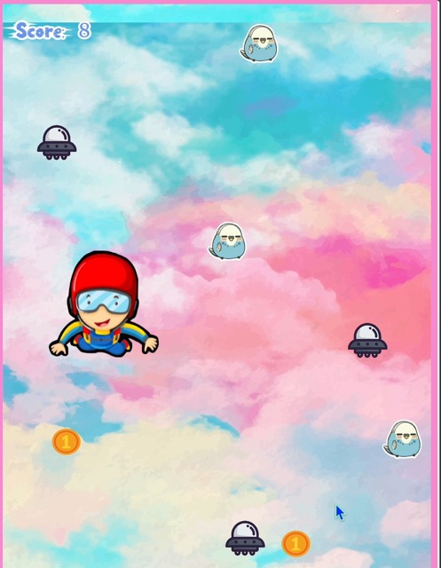

# Infinite Skydiver 🪂

 

A dynamic browser-based game developed using object-oriented JavaScript and p5.js library, challenging players to master aerial navigation while evolving in size.

## 🎯 Objective
Collect 100 golden coins while avoiding UFOs and alien birds. But beware - every obstacle collision makes your skydiver grow larger, increasing difficulty as you progress!

## ✨ Key Features
- **OOP Architecture**: Built with clean class structures for Game, Player, Obstacles, and Points
- **Dynamic Scaling**: Player size increases by 0.6px with each collision
- **Boundary Physics**: Responsive edge detection that adapts to player size
- **Progressive Difficulty**: Intensifying gameplay as player size increases
- **Audio Feedback**: Immersive sound effects for coin collection and background music
- **Win/Lose Conditions**: 
  - 🏆 Win by collecting 100 coins before becoming too large
  - 💥 Lose if you grow beyond 500px width (uncontrollable size)

## 🕹️ Controls
- **Arrow Keys**: Precise aerial movement (← → ↑ ↓)
- **Enter**: Restart game
- **Space**: Start game

## 🚀 Installation
```bash
git clone https://github.com/yourusername/Infinite-Skydiver-Game.git
cd Infinite-Skydiver-Game
open index.html
```

## 🎮 How to Play
1. Avoid incoming UFOs and alien birds
2. Collect golden coins to increase score
3. Manage your growing size strategically
4. Reach 100 coins before becoming too large to maneuver
## 💻 Technologies
- p5.js : Core game rendering and animation
- p5.play : Collision detection and sprite management
- HTML5/CSS3 : UI structure and styling
- JavaScript (ES6) : Game logic with OOP principles
## 🧠 Challenges & Learnings
- "this" Context : Mastered object context binding in class methods
- Dynamic Collision Boundaries : Solved growing player boundary issues through real-time dimension recalculations
- State Management : Implemented smooth game state transitions (splash screen → gameplay → win/lose states)
- Performance Optimization : Efficient object pooling for obstacles/coins
## 📜 License
MIT License - free for educational and personal use. Non Commercial use.
